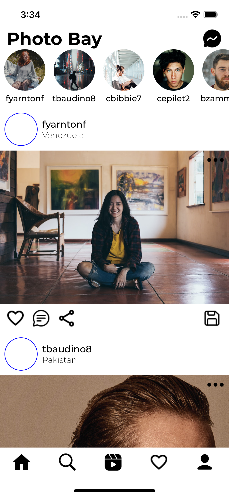
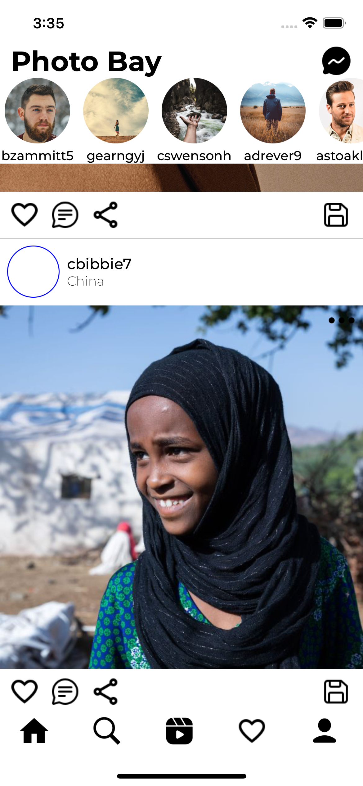

# rn-photobay

📸 Welcome to Photobay, a React Native project inspired by the iconic Instagram experience. This single-page app is a clone design of Instagram. Immerse yourself in a beautifully designed interface featuring a static stories view and a dynamic feed view, where you can like images and discover new content. 🚀


## Screenshots





## Features

- 📚 Static Stories: Engaging stories view.
- 🔄 Refreshable Feed: Pull down to refresh and discover new posts.
- 📱 Cross-Platform: Compatible with iOS and Android.


## Installation

Clone the project

```bash
  git clone https://github.com/rajat258/rn-photobay.git
```

Install rn-photobay with npm

```bash
  cd rn-photobay
  npm i --force
```
I'm using auto-height-image package which is deprecated in react-native so force installation is needed.

#### Install bundle files

```bash
  bundle install
```

#### Note: Make sure your rvm version is 2.7.6

```bash
  rvm use 2.7.6
```

### iOS Installation:

```bash
  cd ios && pod install
```

### Android Installation:

No specific installation required for android.

### Start the server

```bash
  npm run start
```
## Troubleshooting

##### Gradle build error in android:
- Open Android Studio
- Files > Sync files with project
- Build > Clean project
- Build > Rebuild project


## Authors

- [@rajat258](https://github.com/rajat258)

